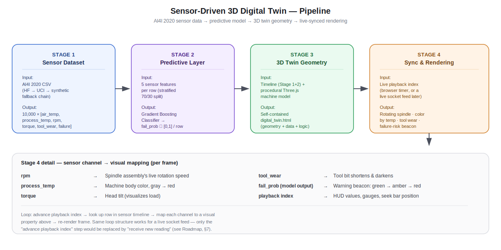

# Sensor-Driven 3D Digital Twin with Live State Synchronization

> **🚧 Status:** Active Research Project (Work in Progress)

An interactive **3D Digital Twin** of a CNC milling machine that continuously synchronizes with sensor data while visualizing **machine health** through an integrated predictive maintenance model.

The project combines **Industrial IoT**, **Machine Learning**, and **3D Visualization** into a lightweight digital twin capable of replaying real industrial sensor streams and displaying live machine state inside a browser-based 3D environment.

---

# Overview

A digital twin is more than a 3D model—it is a virtual representation that remains synchronized with a physical asset and supports intelligent decision-making.

This project implements both essential characteristics of a modern industrial digital twin:

- **Real-time (timeline-based) state synchronization**
- **Predictive maintenance using machine learning**

To remain lightweight and reproducible, the prototype uses the **AI4I 2020 Predictive Maintenance Dataset** as a replayable sensor stream while maintaining the same architecture that would be used for live IoT data.

---

# Pipeline

<p align="center">
    
</p>

<p align="center">
<b>Figure.</b> End-to-end digital twin architecture integrating industrial sensor data, predictive maintenance, and browser-based 3D visualization.
</p>

---

# Features

## Features

- ✅ Browser-based 3D digital twin
- ✅ CNC milling machine visualization
- ✅ Real industrial sensor dataset integration
- ✅ Timeline-based live state synchronization
- ✅ Predictive maintenance using Machine Learning
- ✅ Interactive playback controls
- ✅ Offline self-contained HTML export
- ✅ Three.js rendering
- ✅ Sensor-driven animation

## Planned

- 📌 ESP32 / Arduino live sensors
- 📌 Photorealistic machine reconstruction
- 📌 Gaussian Splatting integration
- 📌 Failure mode prediction
- 📌 Time-to-failure forecasting
- 📌 Cloud deployment

---

# Method Overview

The digital twin follows a four-stage processing pipeline.

```
Industrial Sensor Data
          │
          ▼
Data Processing & Normalization
          │
          ▼
Predictive Maintenance Model
          │
          ▼
Failure Probability Estimation
          │
          ▼
3D Digital Twin
          │
          ▼
Live State Synchronization
          │
          ▼
Interactive Browser Visualization
```

The workflow consists of:

1. Loading industrial sensor data.
2. Training a predictive maintenance model.
3. Estimating failure probability for every timestamp.
4. Synchronizing sensor values with a 3D machine model.
5. Rendering machine state continuously through timeline playback.

The architecture is designed so that replacing the replay dataset with a live IoT stream requires only changing the data source, without modifying the visualization or prediction pipeline.

---

# Implementation Details

## Dataset

**AI4I 2020 Predictive Maintenance Dataset**

Sensor channels include:

- Air Temperature
- Process Temperature
- Rotational Speed (RPM)
- Torque
- Tool Wear
- Machine Failure Label

Dataset loading supports:

- Hugging Face mirrors
- UCI Machine Learning Repository
- Synthetic fallback (development only)

---

## Machine Learning

Current implementation:

- Gradient Boosting Classifier
- Stratified train/test split
- Failure probability prediction
- Probability-based health visualization

Future versions will evaluate:

- XGBoost
- LightGBM
- Random Forest
- Deep Learning models

---

## 3D Visualization

Built using **Three.js**.

Current machine components include:

- Base
- Column
- Machine head
- Table
- Rotating spindle
- Tool bit
- Status beacon

All geometry is generated procedurally.

---

## Live Synchronization

Current synchronization is timeline replay.

Visual mappings include:

| Sensor | Visualization |
|---------|---------------|
| RPM | Spindle rotation |
| Process Temperature | Machine body color |
| Torque | Head inclination |
| Tool Wear | Tool deformation |
| Failure Probability | Health beacon |

---

## Export

The project exports a single standalone

```
digital_twin.html
```

which contains:

- 3D geometry
- Sensor timeline
- Playback engine
- Interactive controls

No backend server is required.

---

# Training Configuration

| Setting | Value |
|----------|-------|
| Dataset | AI4I 2020 Predictive Maintenance |
| ML Library | Scikit-learn |
| Classifier | Gradient Boosting |
| Visualization | Three.js |
| Language | Python + JavaScript |
| Output | Standalone HTML |
| Platform | Kaggle |

---

# Current Progress

The repository is actively evolving.

### Completed

- [x] Dataset integration
- [x] Sensor preprocessing
- [x] Predictive maintenance pipeline
- [x] Gradient Boosting model
- [x] 3D machine construction
- [x] Timeline synchronization
- [x] Interactive visualization
- [x] HTML export

### Currently Working On

- [ ] Live data synchronization
- [ ] Improved predictive accuracy
- [ ] Better machine animation
- [ ] Dashboard improvements
- [ ] Code optimization

---

# Roadmap

## Phase 1 — Digital Twin Foundation

- [x] Sensor dataset
- [x] Predictive model
- [x] Three.js visualization
- [x] Timeline playback
- [x] HTML export

---

## Phase 2 — Live Synchronization

- [ ] WebSocket integration
- [ ] MQTT communication
- [ ] ESP32 data streaming
- [ ] Real-time synchronization

---

## Phase 3 — Machine Intelligence

- [ ] Failure mode classification
- [ ] Time-to-failure prediction
- [ ] Remaining Useful Life (RUL)
- [ ] Confidence estimation

---

## Phase 4 — Visualization Improvements

- [ ] Photorealistic machine model
- [ ] Digital dashboard
- [ ] Interactive analytics
- [ ] Historical trend visualization

---

## Phase 5 — Research Extensions

- [ ] Gaussian Splatting reconstruction
- [ ] Photogrammetry integration
- [ ] Cloud-hosted digital twin
- [ ] Multi-machine monitoring
- [ ] Comparative ML benchmarking
- [ ] Industrial IoT deployment

---

# Results

🚧 **Experimental results will be added as the project progresses.**

Future evaluations will include:

- ROC-AUC
- Precision
- Recall
- F1-score
- Confusion Matrix
- Prediction latency
- Browser rendering performance
- Synchronization latency
- Frame rate benchmarks

Visualization results will include:

- Live synchronization demo
- Interactive dashboard
- Browser screenshots
- Machine health visualization
- Failure prediction examples

---

# References

1. **Matzka, S.**
   *Explainable Artificial Intelligence for Predictive Maintenance Applications.*
   2020.

2. **AI4I 2020 Predictive Maintenance Dataset**
   UCI Machine Learning Repository.

3. **Grieves, M.**
   *Digital Twin: Manufacturing Excellence through Virtual Factory Replication.*
   2014.

4. **Tao, F., et al.**
   *Digital Twins and Cyber–Physical Systems toward Smart Manufacturing and Industry 4.0.*
   Engineering, 2019.

5. **Three.js Documentation**
   https://threejs.org/

---

# Acknowledgements

This repository is an ongoing research project exploring the integration of **Industrial IoT**, **Machine Learning**, and **interactive 3D visualization** for predictive maintenance and digital twin applications. The implementation is designed to be lightweight, reproducible, and easily extensible toward real-world industrial deployments.

---

## Project Status

> 🚧 **Active Research Repository**
>
> Development is ongoing. Features, APIs, and visualization components may change as new experiments, live synchronization capabilities, and predictive models are integrated.
